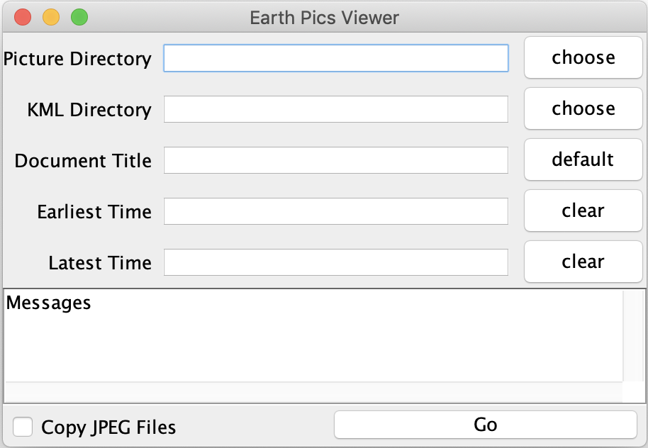

# Earth Pics Viewer

EarthPicsViewer is a utility that takes a list of geotagged photos in a directory and builds a KML file so those the locations of those photos and the photos themselves can be viewed in Google Earth.  The files must be in jpeg format and must have been previously geotagged, that is, have GPS data included.  EarthPicsViewer generates a KML file that, when opened in Google Earth places icons where the photos were taken.  Large numbers of pictures are handled through a level of detail hierarchy where large numbers picture represented by a single numbered placemark when viewed from a distance.

## Running Earth Pics Viewer

To generate the KML file, start by opening the EarthPicsViewer which will pop up a window that looks like this:

 

#### Picture Directory

Either type in or click the choose button to choose the directory containing the JPEG files to be mapped.  Files that are not jpeg files or jpeg files without GPS information will be skipped.

#### KML Directory

Either type in or click the choose button to choose the directory where the KML and associated files are to be put.  The directory must already exist.  Note that an icon directory will also be created in that same directory.

#### Earliest Time (Optional)

If desired, EarthPicsViewer will exclude pictures before the time specified in the Earliest Time field.  If the time is not specified, this field is ignored. The full date and time format is [mm/dd/yyyy hh:mm:ss].  The time of day is optional.

#### Latest Time (Optional)

If desired, EarthPicsViewer will exclude pictures after the time specified in the Latest Time field.  If the time is not specified, this field is ignored.  The full date and time format is [mm/dd/yyyy hh:mm:ss].  The time of day is optional.

#### Copy JPEG Files

If this checkbox is not checked, the KML file will link to the photos in the specified Picture Directory.

If this checkbox is checked, EarthPicsViewer will copy the jpeg files to a subdirectory of the KML Directory.  This makes it easier to copy the entire output to another place where the original Picture Directory may not be available.

#### Go

Clicking the Go button starts the process.  Progress and error messages will show up in the Messages text box.

If you need to fix errors or If you want to process another set of pictures, enter a new or fixed Picture and KML directories and hit the Go button again.  Otherwise, close the EarthPicsViewer window.

## Installation

The source for the icons displayed in Google Earth is available in the Icons.zip file in the repository.  Unzip the  Icons directory make sure it is in the same directory that the application is run from.

## Viewing Pictures from Google Earth

This explanation assumes that Google Earth is installed on the computer.

Double click on the KML file in the directory specified when EarthPicsViewer was run.  Or use the Open menu in Google Earth to select the generated file.  The viewpoint will move to a position looking at the center of the region where the photos are.  Some placemarks indicate a region where photos are placed with a number of photos in that region.  If the region where all the photos are is large and there are no pictures directly in front of the eye position, the icons may not be visible.  If this is the case, move the viewpoint over the region until they come into view.

Placemarks with numbers indicate that there is an indicated number of photos in that region.  Blank placemarks indicate there are more than 400 photos in that region.  Moving closer to one of those will reveal more detailed positions of those pictures.  Finally, placemarks with a photo icon indicate the placement of a particular photo.  Clicking on that icon will pop up a balloon containing the picture and date the picture was taken as well as the file name of the picture.

## The Code

Included in the GitHub repository are the pre-build applications for Windows and MAC.

To build the code yourself, you need the included maven file to get the external library for reading the metadata from the jpeg files.

Here are the external resources that were used to develop this program

1. JavaAPIforKML was used for writing out the KML file and can be found at the Github link here or use the repository in the Maven file [https://github.com/micromata/javaapiforkml](https://github.com/micromata/javaapiforkml)
2. [https://mvnrepository.com/artifact/org.apache.commons/commons-imaging](https://mvnrepository.com/artifact/org.apache.commons/commons-imaging) was used to read the EXIF data such as date and location from the jpeg files.
3. [https://mapicons.mapsmarker.com/](https://mapicons.mapsmarker.com/) was used to generate the numbered map icons.
4. Information about the DBSCAN\_Clustering using K-D trees can be found here: [https://github.com/johnarobinson77/DBSCAN\_clusters](https://github.com/johnarobinson77/DBSCAN_clusters)

A brief explanation of the code is as follows:

1. EarthPicsViewer.main() starts the GUI in InputForms, which calls back buildKML() when the Go button is pressed.
2. After validating the user input, the list of files in the input directory are read
3. Each jpeg file name is passed to the PicsMdata class which reads and stores the metadata and file names.  The location and time stamps are stored in the Locations class which has some convenience functions for accessing geographic coordinates.
4. The locations and time stamps are put into a KdTree.  KdTree searches are run to filter out pictures outside the times and regions (future enhancement).
5. The LocHier class performs the task of creating the hierarchy of image placements using DBSCAN clustering.  The clustering window for the first pass is 1/10th of the bounding box around all data points.  Then recursive clustering is done on each of the clusters for the current level where, for each level, the search window is 1/10th of the previous level of clustering. Recursion stops when there are less than 10 locations in the cluster, or the search window is less than about 500 ft on each side.
6. The LocHier class takes the hierarchy described in 5 and generates a KML folder with level-of-detail information and a list of placemarks for the clusters below it.  If the cluster does not have clusters below it but only locations of pictures, the folder contains placemarks for each of the locations.  The Description in those placemarks contains a pointer to the image.
7. Back in buildKML() the require Icons and jpeg files if requested, are copied to subdirectories of the output directory.  The KML file is also written out.
